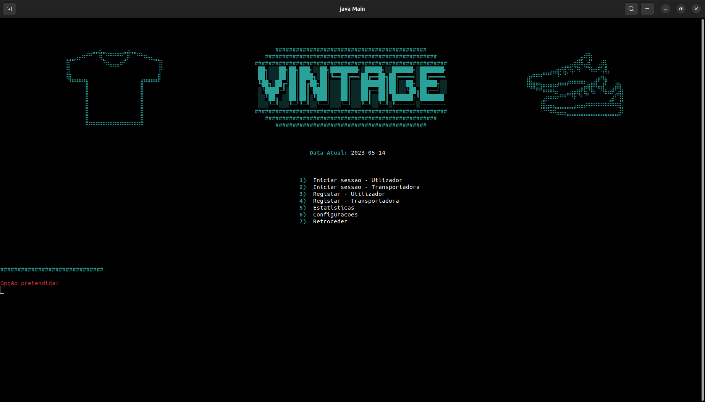

# Vintage - Programação Orientada aos Objetos (2022/23)

Repositório do trabalho prático da UC de Programação Orientada aos Objetos (POO) da Universidade do Minho do ano letivo 2022/23.

## Objetivo

Desenvolver um sistema de marketplace `Vintage` que permita a compra e venda de artigos novos e usados, incluindo `vestuário`, `calçado` e `acessórios`. Os usuários podem atuar como `vendedores` ou `compradores`, adicionando produtos para venda ou realizando compras. O sistema gerencia todas as transações, incluindo a `expedição das encomendas` através de várias `transportadoras`. O objetivo é criar uma simulação realista do funcionamento do marketplace, `permitindo saltos no tempo`, avançando para datas futuras e atualizando automaticamente as transações pendentes, bem como `guardar/ler o estado da aplicação` e possuir capacidade de `automatização` pela leitura de um ficheiro. O sistema deve ser robusto, permitindo a interação com os usuários por meio de `menus de texto` e garantindo a gravação e recuperação do estado do programa a qualquer momento. Todo o Projeto deverá obdecer às boas práticas de `programação orientada aos objetos`, `polimorfismo`, `herança`, `encapsulamento`, entre outros lecionado nas aulas.

## Colaboradores

|    **Nome**    | **Número** |
|:--------------:|:----------:|
| [Lucas Oliveira](https://github.com/LucasOli20) |   A98695   |
|   [Mike Pinto](https://github.com/mrmikept)   |   A89292   |
|  [Rafael Gomes](https://github.com/RafaGomes1) |   A96208   |

## Conteúdo

Este repositorio possui:

- [Enunciado](./enunciado.pdf)
- [Relatório](./report.pdf)
- [Código Fonte](./Project/src/)
- [Ficheiros de Estados](./Project/Estados/)
- [Ficheiro de Automatização](./Project/Automatizacao/dataset.csv)

## Nota do projeto: 18 valores
